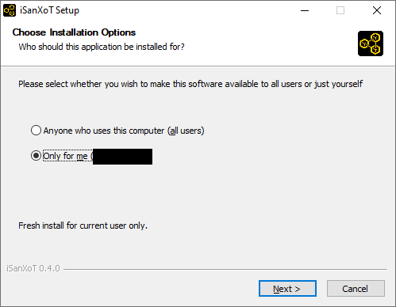
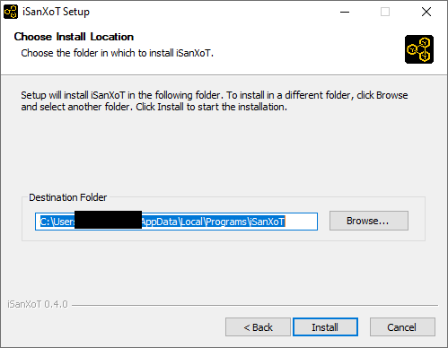
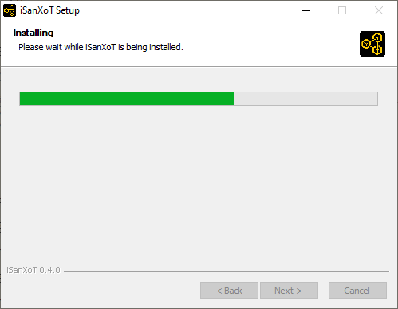
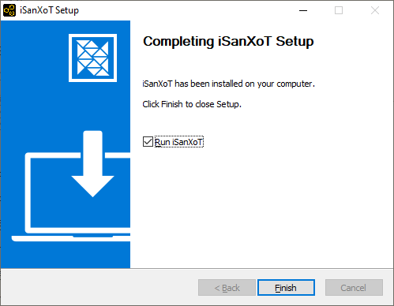
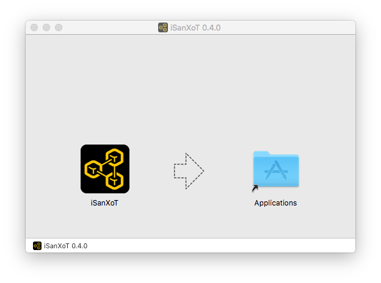
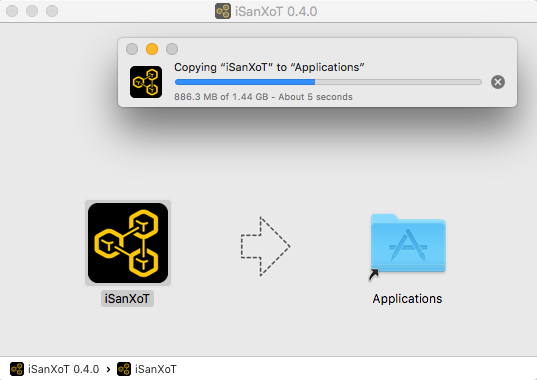
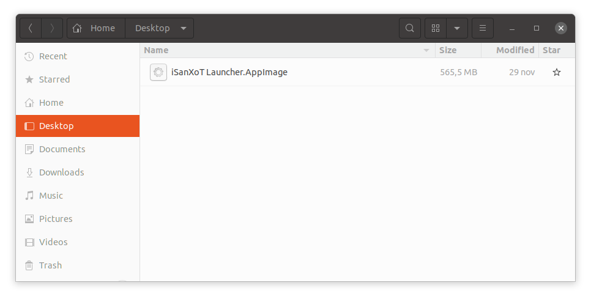

# iSanXoT Installation

## Windows distribution

<!-- ### Requirements for Windows distribution

iSanXoT uses Windows Python packages which needs via the SDK to build code. Thus, Microsoft Visual C++ 14.0 or greater is required. On Linux and Mac, the C++ libraries are installed with the compiler.

Get the "Microsoft C++ Build Tools" by one of these choices:

- from an offline installer: [vs_BuildTools.exe](env/vs_BuildTools.exe) (Recommended).
- from [Microsoft Build Tools for Visual Studio] (https://visualstudio.microsoft.com/thank-you-downloading-visual-studio/?sku=BuildTools&rel=16)

When the Microsoft Build Tools is opened, select:

    Workloads → Desktop development with C++
    
Then for Individual Components select only:

    - Windows 10 SDK
    - C++ x64/x86 build tools (MSVC - VS)

More references:

https://www.scivision.co/python-windows-visual-c++-14-required/ -->

<!-- https://www.scivision.dev/python-windows-visual-c-14-required -->
<!-- Visual C++ Redistributable para Visual Studio 2015 -->
<!-- https://stackoverflow.com/questions/44290672/how-to-download-visual-studio-community-edition-2015-not-2017 -->
<!-- https://go.microsoft.com/fwlink/?LinkId=532606&clcid=0x409 -->
<!-- https://www.microsoft.com/es-es/download/details.aspx?id=48145 -->

<!-- ### Installation on Windows -->

The iSanXoT application for Windows distribution is packaged in a NSIS Launcher (exe file).

Download the Launcher in the assets part from the *release* link:

https://github.com/CNIC-Proteomics/iSanXoT/releases

Double-click the Laucher file to open it, and you'll see an Installer window.

Then, you can choose the folder in which to install iSanXoT.

Important!! For the moment, we recommend to installation 'Only for me'.

Wait while iSanXot is being installed

Finally, you'll see a window telling you completed setup. You can run iSanXoT immediately if you want.

## MacOS distribution

The iSanXoT application for MacOS distribution is packaged in a DMG container.

Download the DMG file in the assets part from the *release* link:

https://github.com/CNIC-Proteomics/iSanXoT/releases

Double-click the DMG file to open it, and you'll see a Finder window. Often these will include the application itself, some form of arrow, and a shortcut to the Applications folder.

Simply drag the iSanXoT icon to your Applications folder...

and you're done: the iSanXoT app is now installed.

## Linux distribution

The iSanXoT application for Linux distribution is packaged in a AppImage.

Download the AppImage in the assets part from the *release* link:

https://github.com/CNIC-Proteomics/iSanXoT/releases

Double-click the AppImage file to open it...

and you're done: the iSanXoT app is now installed.

---

### [← Main Readme](README.md) | [↑ Top](INSTALL.md)