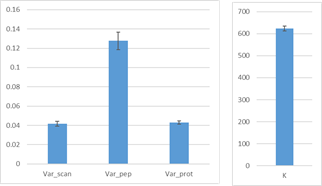

___
## 1.0.2
```
DATE: 2022_05
```

### Changes in the Graphical User Interface

+ Adaptor: Bug fixed: the window in the adaptor was not displayed correctly.

+ Adaptor: Allow the read of large files size.

### Changes in the Code Workflow

+ RELS_CREATOR: Now the delimiter in category files is '//'.


___
## 1.0.1
```
DATE: 2022_05
```

### Highlights

+ New general adapter to handle the results from proteomics pipelines: TPP, FragPipe, MaxQuant, Proteome Discoverer, etc.

+ New CNIC adapter to habdles the results from search engines and to calculate the pRatio, add the quantificacions, and calculate the most probable protein.

+ LEVEL_CALIBRATOR accepts the K-constant, the variance, and 'More params'

+ iSanXoT Wiki: https://github.com/CNIC-Proteomics/iSanXoT/wiki

### Changes in the Graphical User Interface

+ New General Adapter to handle the results from proteomics pipelines: TPP, FragPipe, MaxQuant, ProteomeDiscoverer, etc.

+ New CNIC adapter to habdles the results from search engines and to calculate the pRatio, add the quantificacions, and calculate the most probable protein.

+ We have created some case studies to ilustrade the type of workflows:
	- WSPP: Work by González-Amor M, et al. Cardiovasc Res. 2021
		* WSPP step by step without asterisks (the jack of all trades)
		* Report:
			- Npep2prot_Quanprot: Zq, Nq(npeptides/prot)
	- WSPP-SBT: Work by García-Marqués F, et al. Mol Cell Proteomics. 2016:
		* Biology Systems: WSPP-SBT
		* Report using the asterisk (the jack of all trades)
			- Npep2prot_Quanprot: Zq, FDRq, Nq(npeptides/prot)
			- Nprot2cat_Quancat: Zc, FDRc, Nc(nprots/cat)
			- Zprot2cat_Quanprot_Quancat: Zq, Zc
	- WSPP_NORCOMBINE_RATIOS_SBT: Work by González-Amor M, et al. Cardiovasc Res. 2021
		* Report using the asterisk (the jack of all trades)
			- Npep2prot_Quanprot: Zq, FDRq, Nq(npeptides/prot)
		* Report using the asterisk (the jack of all trades) (1 sample)
			- Npep2prot_Quanprot: Zq, FDRq, Nq(npeptides/prot)
			- Nprot2cat_Quancat: Zc, FDRc, Nc(nprots/cat)
			- Zprot2cat_Quanprot_Quancat: Zq, Zc
		* Report produced by the merge of the sample reports with the ratios sample report (SBT)
	- WSPP_PTM: Work by Bonzon-Kulichenko E, et al. J Proteomics. 2020
		* WSPP step by step using asterisks (the jack of all trades)
		* Report using the asterisk (the jack of all trades)
			- Npep2prot_Quanprot: Zq,  FDRq, Nq(npeptides/prot)
			- Npep2prot_Quanprot: Zpq, FDRpq, Ns(nscans/pep)

+ 'More params", the 'more params' has been improved.

+ LEVEL_CALIBRATOR accepts the K-constant, the variance, and 'More params'.

### Changes in the Code Workflow

+ TABLETOCFG:
	- Fixing the file that forces the variance in the integrations.
	- Print all processes but forced or not.

+ SANSON: Fixing a bug in the filter of SANSON. The filter needs the parenthsis:
	([FDR] < 0.05) & ([n_rel] >= 10) & ([n_rel] <= 100) 

+ Integrations: force the parameters and create a file with the variance when the vatiance has been forced by the user in the task-table.

+ RELS_CREATOR: Admits the ID-q.tsv files as default.

+ New general adapter to handle the results from proteomics pipelines: TPP, FragPipe, MaxQuant, Proteome Discoverer, etc.

+ Improved the program that reports the integrated variances.

+ New program that reports the K-constant and the graphs of calibration.

+ New program that retrieves the times of workflow execution.

+ Fixing a problem with the Linux and Mac distribution.

Comments:

+ In Create new project, in the first menu you should put Name of the Project Folder and the second Path to locate the Project Folder.

+ In Open Project, change to Open Project Folder.

+ In project logs table it should be indicated (press the process to see the workflow logs).

+ In workflow logs it should be indicated (press the command to see the command logs).

+ Instead of Start, put Save and Run.

+ Menu name to Project.

+ Change the 'Adapter' tab to 'Input File'.

+ The getVariances program will return "sample/integration/Variance/TotNElems/ElemExcluded/IntegratedNElems..."


___
## 0.4.4
```
DATE: 2022_02
```

### Highlights

+ PROTEIN_ASSIGNER is the new Module for CNIC Adaptors.

+ The REPORT module can retrieve the X'inf and Winf from the _lowerNormW files.

### Changes in the Graphical User Interface

+ We have included more details in the short description for the SBT module and RATIOS module.

+ Create general adaptors for the search engines: Proteome Discoverer, MSFragger, Comet and MaxQuant.

+ Fixing a minor problem loading the adaptors.

+ PROTEIN_ASSIGNER is the new Module for CNIC Adaptors.

### Changes in the Code Workflow

+ Minor changes: changes the descrioption of ratios command.

+ Now, the modules of adaptors are independent.

+ TABLE2CFG: fixing a problem with the unique function. We want the unique list but without sort.

+ General Adaptors for Proteome Discoverer, MSFragger, Comet, and MaxQuant:
	- These adaptors only create the columns: Experiment, Scan_Id, and Peptide_Id.
	- The calculation of Peptide_Id is without the DeltaMass forgetting the unimod file.

+ CNIC Specific Adaptors:
	- These adaptors have the FDR calculation including the cXCorr (for PD).
	- There is a new Module for CNIC Adaptors: ProteinAssigner 

+ KLIBRATE: When the number of cycles in calibrate is exceeded, we can use k=600, var=0.04 by default. This is based on the values from PESA project:


+ REPORT:
	- Bug fixed: the program does not retrieve the Xsup value.
	- The program can retrieve the X'inf and Winf from the _lowerNormW files.

___
## 0.4.3
```
DATE: 2022_02
```

### Changes in the Code Workflow

+ Force the execution of Main-Input adaptor.

+ Mysnake: we have developed a new way to obtain the list of processes.

___
## 0.4.2
```
DATE: 2022_01
```

### Highlights


### Changes in the Graphical User Interface

+ The Adaptors tab has been renamed to 'Adaptor'.

+ Fixing a bug in Comet Adaptor.

+ Approximation to fix the problem when the administrator wants to install iSanXoT.

+ Discard the close search words.

+ Add list of scores that will use the FDR module adaptors by default.

+ New validation of the workflow schema:
	Check if the input files exit in the table2cfg.

### Changes in the Code Workflow

+ Include some shell/batch scripts that prepares the environment for the build packages.

+ Fixing a bug in the function that retrieves the folder name of jobs


___
## 0.4.1
```
DATE: 2021_12
```

### Highlights

+ Added more documentation.

### Changes in the Graphical User Interface

+ Rename 'Output folder' to 'Output Sample folder'.

+ Modify a little bit the color style.

+ Change the label of input adaptors.

+ Add 'Roboto' fonts for offline mode.

### Changes in the Code Workflow

+ Added more documentation:
	- Installation.

+ Adaptor-Comet:
	- The list of descriptions has to be separated by commas.
	- Bug fixed: the get_stats is redundacy in the tpl_commnds of masterq

+ Some programs moved from SanXoT folder to cmd.

+ Add version in the release build.

+ New implementation for the installation. We have to included the Python packages for each distribution.

+ GETVARIANCES: fixing the function that gets the job name.

+ Move stats script into "cmds" folder.

+ REPORT: 
	- Add values from RT checking first the lowr_level and then, the higher_level
	- For the momento, don't sort the columns

+ We have discarded snakemake because "datrie" packages has problems with the three distributions. 

+ Discards the title.

+ Discard the open search adaptors.

___
## 0.4.0
```
DATE: 2021_11
```

### Highlights

+ iSanXoT distribution for Windows, Mac, and Linux in x64:
	+ **Windows 10 Pro** (x64)
	+ **MacOs High Sierra** (10.13.6)
	+ **Ubuntu 20.04** (x64)


+ More documentation.

### Changes in the Graphical User Interface

+ Adaptor Open MSF:
	- Bug fixed: it needs the masterq process.

### Changes in the Code Workflow

+ LEVEL_CREATOR: fix a problem with "-w" parameter.


___
## 0.3.4
```
DATE: 2021_11
```

### Highlights

+ Create a windows for the documentation.

+ REPORT: Bug fixed sorting the columns.

### Changes in the Graphical User Interface

+ Adaptor Input PD: The button of Input folder has been fixed.

+ The following adaptors have been included:
	- Adaptor for Comet Input (Close search).
	- Adaptor for Comet-PTM Input (Close search).

### Changes in the Code Workflow

+ REPORT:
	- Bug fixed sorting the columns.
	- It doesn't increase the rows when we add information from Relation Table. It uses only the keys from the Report table.

+ TPL_COMMANDS:
	- Correct the relate tables in the compounds commands.

+ TABLE2CFG:
	- Replace "\" to "/" to accepts paths within "More_params"; otherwise the JSON crashes.

___
## 0.3.3
```
DATE: 2021_10
```

### Highlights

+ REPORT: Comment the code lines that sort the columns because it is not working correctly.

### Changes in the Graphical User Interface

### Changes in the Code Workflow

+ REPORT: Comment the code lines that sort the columns because it is not working correctly.

___
## 0.3.2
```
DATE: 2021_10
```

### Highlights

+ CNIC Adaptors in Close search for PD and MSF have been included.

+ The RELS_CREATOR command retrieves the column names of Relation Tables (RT) with the same names that the levels indicated by the user.

+ The REPORT command merge the Report Table (RPT) with multiple external tables. The only condition is the external tables have to contain a unique column name like the lower level of RPT.

+ Bug fixed and more improvementshave been implemented.

### Changes in the Graphical User Interface

+ INSTALL: The "installer" program has been modified to fix the problem with spaces in the path.

+ Update of column names and the description of modules.

+ Rename KLIBRATE to LEVEL_CALIBRATOR. Modify this task-table.

+ If the task-table is empty and the task-table file exists, now it deletes the task-table file for the updating.

+ Update the sidebar of commands when the task-table is full.

+ The commands: LEVEL_CALIBRATOR, INTEGRATE, SBT, SANSON accept a list of inputs. In that case, the cmds REPORT and NORCOMBINE have changed the input column.

+ RELS_CREATOR: The columns 'sup_infiles', 'thr_infiles', and 'filter' have been discarded for the momment.

+ WSPP_SBT, WSPPG_SBT, WPP_SBT, WPPG_SBT accept the "Identifier column header".

+ Fixing the project-workflow log table.

+ Problems with the Force execution have been fixed.

### Changes in the Code Workflow

+ REPORTER:
	- Fixing bug: Now, it extracts the low level matching the first number 2 from the name file of relation table.
	- It retreives the current report table altought the merge with another report tables doesn't work.
	- Sort the columns from the given sample list.
	- The Relation Table could be external of project.
	- The reported_variables is optional and it create a report only with levels.

+ RELS_CREATOR:
	- Rename the column headers based on the name of output file.

+ TABLE2CFG:
	- Fixed a bug: Now, the "merge with report table" parameter accepts external files.
	- The "Merge relate table" in REPORT cmd accepts a full path of RT file and a RT name that is in the rels folder of project.

+ TPL_COMMANDS:
	- Fixed a bug in the variant assignation. The variants have to be assigned in the sanxot1 and sanxotsieve.

+ FDR and MASTERQ (FDR_Q):
	- The masterq function (retrieves the first sorted protein alphanumerically) has been included in the FDR program.


___
## 0.3.1
```
DATE: 2021_09
```

### Highlights

+ Some "bugs"has been fixed for the WF-PTM

### Changes in the Graphical User Interface

+ INSTALL: The "installer" program has been modified to be more general.

+ The number of columns in the task-tables are always equal than the expected.

+ TABLE2CFG: Fixing a bug when there is '**' in the path. We have to disable a function that sustitutes the '**' by the current files (with glob) because otherwise the last part of program that replaces the '**' with the outputs, doesn't work.

### Changes in the Code Workflow

+ CREATERELS: The delimiter that divides the categories of a protein, has changed from ";" to "||" (iSanXot-dbscripts v2.5). For this reason, this program has been updated.

___
## 0.3.0
```
DATE: 2021_08
```

### Highlights

+ Basic workflow.

+ New design for the projects and workflows.

### Changes in the Graphical User Interface

+ Add number of threads from the loading proyects.

+ It is not requiered the version in the .cfg files.

+ The logs for each command processes is shown in a modal window.

+ The process panel also shows the logs of opened project.

+ New panel of inputs that allows to insert any file into iSanXoT.

+ Add short description for the modules.

+ TODO!!! ARREGLAR LOS PORCENTAJES DE LOS LOGS.

+ TODO!! PONER EL AVERAGE EN LOS RATIOS.

### Changes in the Code Workflow

+ NodeJs updated to version.

+ ElectroJs updated to 13.1.2 version.

+ CREATEIDQUANT: Discards the comment lines starting with '#'.

+ REPORTER:
	- Gets the name of 'experiment' until the root folder.
	- Bug fixed: The NaN values are taked into account in the output converting into empty values.

+ NORCOMBINE: The analysis name has changed. It includes the 'comb' prefix.

+ The sigmoides are distinguished from the first sanxot and the second sanxot in an integration.

+ STATS: get the link to sigmoide... Important: The sigmoide with outliers (first sanxot).

___
## 0.2.12
```
DATE: 2021_05
```

### Highlights


### Changes in the Graphical User Interface

+ Fixed bug. The optional columns for the commands don't appears when they are fill it.

+ Fixed bug: Loading a project from the "processes" page.


### Changes in the Code Workflow

+ WSPP_SBT: The "key-words:" Scan, Peptide, Protein, and Category have been established. The key-word "SequenceMod" has changed to "Peptide"

+ The quantification program (createIDQuant) accepts files with the "Ion Distribution".

+ RATIOS:
  - Remove leading and trailing whitespaces.
  - Remove whitespaces.

+ TABLE2CFG:
  - Removes whitespaces before/after comma
  - Replace "," to "-"


___
## 0.2.11
```
DATE: 2021_05
```

### Highlights


### Changes in the Graphical User Interface

+ The parameters of RATIOS command (Tag, FDR and Var(x)) have been deleted because they weren't needed.

+ The prefix '__MAIN_INPUTS_' has been deleted in the constant names.

+ Remove the Category file section from 'Databases' tab.

### Changes in the Code Workflow

+ The prefix "__MAIN_INPUTS_" has been deleted in the constant names.

+ The folder "preSanXoT" has been renamed to "adaptors".

+ REPORT program accepts multiple relationship files. It is only necessary to add the relationship name in the REPORT task-table.

+ PD, MSF and Comet now include 'Protein_Descriptions' column based on their own columns.

+ 'ID.tsv' from MaxQuant results now include the 'Protein_Description' column getting the first value.

+ MASTERQ: The FASTA input parameter is OBSOLETE. Now, we use only the 'Protein_Description' from the results of search engines.

+ CREATEIDQUANT: The columns need to recognize the search engine have changed.

+ STATS programs: Two programs have been included in the workflow. A program which gets the ID statistics, and other that gets the variances with the sigmoide image for each integration.

+ SANXOT v2.20: retrieves the error message using the sys.exit().

+ SANSON v1.14: retrieves new error message when the higherElement file is empty.

+ TABLE2CFG and MYSNAKE: the global variables have been included in a different module.

+ RATIOS: Trace log has been added when the tags are not available in the data.

+ MYSNAKE: The program, which creates the report of variances, has been added.

+ CREATERELS:
	- Adds new function that replaces the 'Protein' column by the new xref column name, if it is applicable.
	- New design in the algorithm to reduce the time/memory in the execution.
	- Filter section has been included.

+ TPL_COMMANDS:
	- Some variances in the WSPPG_SBT have changed.
	- The "_outStats" file from sanxot1 has been renamed to distinguish from sanxot2 

+ Common library for the scripts has been created.

+ SANSON:
	- New program has been developed that filter the third column.
	- Joiner program has been added to the command.


___
## 0.2.10
```
DATE: 2021_04
```

### Highlights

+ The "REPORT" program has been improved.

+ The parameters for the third column has been revised.

### Changes in the Graphical User Interface

+ The GUI includes the CREATE_IDQUANT command but it is a preliminar implementation.

### Changes in the Code Workflow

+ There is a preliminar implementation of CREATE_IDQUANT program that accepts the identifications from the search engines: PD, Comet and MSFragger. It is not ready yet!!

+ In the case of duplicated scans for Comet results, we take the scans with the best cXCorr and then, with the duplicated, we get the first one.

+ masterQ: The "Description" is removed if the value is not created.

+ createRes: The program has been simplified. The third column is retrieved correctly.

+ The Database task-table has changed. The filter columns has been deleted.

+ The "REPORT" program has been improved:
	- It accepts any kind of level name.
	- It merges all the columns from the inpu "relationship" file.
	- It filters by multiple columns or single column.

+ The filename of logs has changed.

+ The parameters for the third column has been revised.

+ Include all outputs for each sanxot-sanxotsieve-sanxot in the INTEGRATION and SBT commands.


___
## 0.2.9
```
DATE: 2021_03
```

### Highlights

+ The Basic PTM workflow is optimised.

### Changes in the Graphical User Interface

+ Open correctly the dialog to load the input files in a PTM workflow.

+ Style changes.

+ Load correctly the "input file" table.

### Changes in the Code Workflow

+ The createRels program admits the ':' delimter for the join of columns.

+ The REPORT program shows the level without relationship with the high-level. For example, it shows the protein without descriptions or it shows the protein without genes.

+ Filtering correctly the file used by SANSON program.


___
## 0.2.8
```
DATE: 2021_03
```

### Highlights

+ Pre-release of PTM workflow.

### Changes in the Graphical User Interface

+ PTM workflow has been included. It is a preliminar version.

+ The interface accepts the input files for the PTM workflow.

+ Add an auto overflow for worlflow log table.

+ The identifier of HTML elements for the inputs have changed.

### Changes in the Code Workflow

+ Scan Id column has been added in the ID.tsv files. The value is "[Spectrum_File]-[Scan]-[Charge]" for the search engines: PD, MSFragger and Commet. 
Therefore, the WSPP_SBT will accept that column values.

+ The samples files will have a version prefix.

+ The keys for the inputs: indir, outdir, catfile, etc. have changed.

+ The Default parameters for the "createSansonLevel" are included in the "tpl_commands".

+ "stats" file in "sanxot" program: Fix the bug when the given list is empty.

___
## 0.2.7
```
DATE: 2021_03
```

### Highlights

+ Improvements in the REPORT command.

+ The installation module has been improved.

+ The image of Sanson diagram is reported.

### Changes in the Graphical User Interface

+ The appareance of worked-out examples has changed.

+ The structure of workflow config file has changed.

+ The Mar. 2021 database has been added.

+ Improvements in the log tables of processes.

+ The REPORT command has new colummns.

### Changes in the Code Workflow

+ Improvements in the REPORT program:
	+ New way to propvide the "description" info for the given level.
	+ There is a new parameter 'show_leves' that allows us to say which levels we want in the report file.
	+ Merge the given intermediate report using the union of keys from both frames.

+ The installation module has been improved. Now, it install another programas like "java", "dot", etc. The installation of forced modules has been disabled.

+ The image of Sanson diagram is reported.

+ Bug fixed: In some cases, the report program needed the files "gene2description" and "category2description". Now, these files are created in the Database table.


___
## 0.2.6
```
DATE: 2021_02
```

### Highlights

+ We have started to include some documentation.

+ Due we have included a "force" column for each tasktable. For this reason, *this version is not compatible with projects executed by iSanXoT's with lower versions*.

### Changes in the Graphical User Interface

+ There is some documentation.

+ Gramatical changes.

+ The internal files of the application have been restructured.

+ We have included the "force" column that is a flag for the forced execution of command.

+ We have included the "gene2description" relationship file in the table.

+ Bug fixed: exporting the tasktable of databases section.

### Changes in the Code Workflow

+ Bug fixed - createRels:
	- There were a problem reporting the category2categoryall files when the input database came from two or more species. In the reindex of dataframe.
	- there were empty cells.

+ Now, the table "Select input files" accepts a filename and the path of file for the column "Infile".

+ The NextCloud url where the databases and samples are saved, have changed.

+ report:
	- We include the 'gene' column to the correct report.
	- we delete the all columns correctly. 

+ installer: Now, we force the installation of some parts of requirements.

___
## 0.2.5
```
DATE: 2021_02
```

### Highlights

+ We have changed the visualization of Log panels of GUI.

### Changes in the Graphical User Interface

+ We have fixed the filter of REPORT command.

+ Bug fixed: When you create a workflow from the scratch, there is a conflict with the relationship tables (CatDB and CatFile). Both tables are created. Then, two processes create the same relationship file.

+ The table of sanson command needs another Norm column: Lower norm and Higher norm.

+ If at least one cell of optinal parameters is filled, then the "advanced parameters" is shown.

### Changes in the Code Workflow

+ Bug fixed: The filter function was not working correctly in the REPORT command. The pandas "eval" function did not filter correctly.

___
## 0.2.4
```
DATE: 2021_01
```

### Highlights

+ We have changed the workflow managment system. Now we have developed "mysnake"

### Changes in the Graphical User Interface

+ The GUI executes the new workflow managment system (MySnake).

+ The validation menu has been deprecated.

### Changes in the Code Workflow

+ We have created "mysnake" workflow managment system but we still use "snakemake" to know the list of processes for the workflow.

+ We have changed the config file of workflow. Now, the rows of tables represents the commands.
For that, there are a list of commands and each command is composed by list of rules (programs).

+ We have changed some internal programs of workflow. First, they save the results in temporal file and then, they rename to the final file name.

___
## 0.2.3
```
DATE: 2021_01
```

### Highlights

+ We have included a new condition for sanxot program.

### Changes in the Graphical User Interface

+ tpl_commands.yaml: The "-m 600" parameter has been added into all the firsts comands of sanxot.

### Changes in the Code Workflow

+ sanxot: The "emergencyvariance" has been changed.
In the case the maximum iterations are reached (see -m), force the provided variance by the user. Default 0.0

___
## 0.2.2
```
DATE: 2021_01
```

### Highlights

+ We have included the WSPPG-SBT command in the basic workflow.

### Changes in the Graphical User Interface

+ We have included the WSPPG-SBT command in the basic workflow.
+ We include the commands only by the configuration file (workflow.json)
+ We merge common functions for the programs: table2cfg, ratios, create_id

### Changes in the Code Workflow


___
## 0.2.1
```
DATE: 2020_12
```

### Highlights

+ The use of UniProtKB database to create the relationship files.

### Changes in the Graphical User Interface

+ We have divided the interface that create the relationship files. Now, it accepts the protein-category file and the database version of UniProtKB.


### Changes in the Code Workflow


