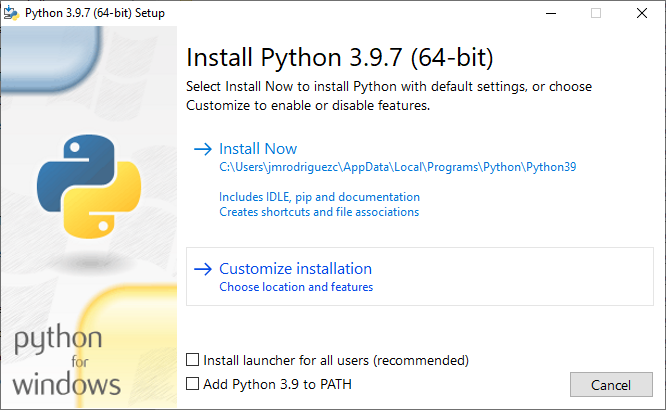
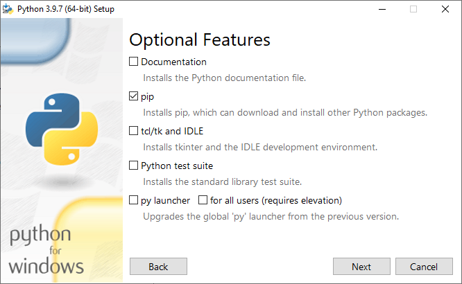
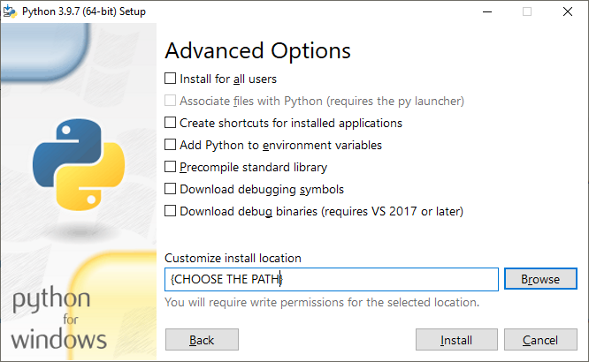

# Steps how to create an environment for iSanXoT

This documentation is for iSanXoT developers.


## Clone the repository

1) Clone the iSanXoT repository
```
git clone https://github.com/CNIC-Proteomics/iSanXoT.git
```
2) Access to folder
```
cd iSanXoT
```

## Execute iSanXoT in debug mode for Windows distribution

### Create the python environment: Install just python in the resource folder

<!-- python-3.9.7-amd64.exe /passive  InstallAllUsers=0  PrependPath=0  Include_pip=1  Include_lib=1  Include_tools=1  Include_symbols=0  Include_test=0  Include_tcltk=0  InstallLauncherAllUsers=0  Include_launcher=0 Include_doc=0  Shortcuts=0  AssociateFiles=0  TargetDir="S:\U_Proteomica\UNIDAD\DatosCrudos\jmrodriguezc\projects\iSanXoT\env\python\Python-3.9.7" -->

1) Create python folder
```
mkdir "S:\U_Proteomica\UNIDAD\DatosCrudos\jmrodriguezc\projects\iSanXoT\env\python\Python-3.9.7"
```

2) Install just python in the resource folder

  2.1) Customize installation:


    
  2.2) Optional features:
  Without documentation, tck, ONLY pip



  2.3) Choose the path:
  Do it in "env\python\Python-3.9.7"



3) Copy the cached installation of python
```
xcopy /E /I "env/python/Python-3.9.7"  "app/resources/exec/python-3.9.7-win-x64"
```

### Create the frontend environment

1) Execute:
```
cd "S:\U_Proteomica\UNIDAD\DatosCrudos\jmrodriguezc\projects\iSanXoT"
```
```
set %PATH%=%PATH%;C:\Users\jmrodriguezc\iSanXoT\env\node-win-x64&& env\com.env.win.bat "S:\U_Proteomica\UNIDAD\DatosCrudos\jmrodriguezc\projects\iSanXoT\app\resources\exec\python-3.9.7-win-x64\python.exe" "C:\Users\jmrodriguezc\iSanXoT\env"
```
Note: You have to write in this way:
...\env\node-win-x64&& (without space)
Note: The frontend folder (node) has to be in local because otherwise the "OpenDevTools" does not work.

2) Copy the multiple node modules that are not within npm packages to the app folder:
Open CMD
```
cd "C:\Users\jmrodriguezc\iSanXoT\env\node-win-x64\node_modules"
set O=S:\U_Proteomica\UNIDAD\DatosCrudos\jmrodriguezc\projects\iSanXoT\app\resources\node_modules&& for %a in ("ps-tree" "n-readlines") do (mkdir "%O%/%~a"&& xcopy /E /I "%~a" "%O%/%~a")
```

3) Add the Node path into environment variable:
Open CMD
```
setx PATH "%PATH%;C:\Users\jmrodriguezc\iSanXoT\env\node-win-x64"
```
Close CMD

### Build iSanXoT

1) Prepare the environment for build packages
```
env\prepare_isanxot_build.win.bat
```

2) Build iSanXoT
```
cd app
"C:\Users\jmrodriguezc\iSanXoT\env\node-win-x64\electron-builder"
```

### Execute iSanXoT in debug mode

1) Prepare the environment for debug mode
```
env\prepare_isanxot_debug.win.bat
```

2) Execute iSanXoT in debug mode
Open CMD
```
cd app
set ISANXOT_MODE=debug&& set ISANXOT_DEV=local&& "C:\Users\jmrodriguezc\iSanXoT\env\node-win-x64\npm" start
```

Note: You have to write in this way:
=debug&& (without space)

Note: Open iSanXoT application in debug mode
```
cd "C:\Program Files\iSanXoT"
set ISANXOT_MODE=debug&& .\iSanXoT.exe
```

### In the case there are new python packages: Download the Python packages
1) Extract the Python packages
```
"S:\U_Proteomica\UNIDAD\DatosCrudos\jmrodriguezc\projects\iSanXoT\app\resources\exec\python-3.9.7-win-x64\Scripts\pip3.9.exe" freeze > app/resources/env/packages/win-x64/requirements.txt
cd app/resources/env/packages/win-x64
"S:\U_Proteomica\UNIDAD\DatosCrudos\jmrodriguezc\projects\iSanXoT\app\resources\exec\python-3.9.7-win-x64\Scripts\pip3.9.exe" download -r requirements.txt
ls -1 > requirements_local.txt
```


---


## for MacOS distribution

### Create the python environment: Install just python in the resource folder

1) Install just python in the resource folder

    2.1) Uncompress python
    ```
    cd env/python
    tar -xvf Python-3.9.7.tgz
    cd Python-3.9.7
    ```
    2.2) Configure python to install in user folder
    ```
    ./configure --prefix=/Users/proteomica/projects/iSanXoT/app/resources/exec/python-3.9.7-darwin-x64
    ```
    2.2) Make
    ```
    make
    ```
    2.3) Make install
    ```
    make install
    ```

### Create the frontend environment

1) If it is from the Scratch, uncompress the node for MacOS
```
cd /Users/proteomica/projects/iSanXoT/env/node
tar -xvf node-v14.16.0-darwin-x64.tar.gz && mv node-v14.16.0-darwin-x64 node-darwin-x64
cd ../../
```

2) Execute program that creates the frontend enviroment
```
export PATH=/Users/proteomica/projects/iSanXoT/env/node/node-darwin-x64/bin:$PATH && ./env/com.env.darwin.sh /Users/proteomica/projects/iSanXoT/app/resources/exec/python-3.9.7-darwin-x64/bin/python3  /Users/proteomica/projects/iSanXoT/env/node
```

### Build iSanXoT

1) Prepare the environment for build packages
```
env/prepare_isanxot_build.darwin.sh
```

2) Execute the program that builds the packages
```
cd app
export PATH=/Users/proteomica/projects/iSanXoT/env/node/node-darwin-x64/bin:$PATH && /Users/proteomica/projects/iSanXoT/env/node/node-darwin-x64/bin/electron-builder
```

### Execute iSanXoT in debug mode

1) Prepare the environment for debug mode
```
env/prepare_isanxot_debug.darwin.sh
```

2) Execute iSanXoT in debug mode
```
cd app
export ISANXOT_MODE=debug && export ISANXOT_DEV=local && export PATH=/Users/proteomica/projects/iSanXoT/env/node/node-darwin-x64/bin:$PATH && /Users/proteomica/projects/iSanXoT/env/node/node-darwin-x64/bin/npm start 
```

Note: Open iSanXoT application in debug mode
```
cd /Applications
export ISANXOT_MODE=debug && open -a "iSanXoT.app"
```

### In the case there are new python packages: Download the Python packages

1) Extract the Python packages
```
/Users/proteomica/projects/iSanXoT/resources/exec/python-3.9.7-darwin-x64/bin/pip3 freeze > resources/env/packages/darwin-x64/requirements.txt
cd resources/env/packages/darwin-x64
/Users/proteomica/projects/iSanXoT/resources/exec/python-3.9.7-darwin-x64/bin/pip3 download -r requirements.txt
ls -1 > requirements_local.txt
```


---


## for Linux distribution

### Create the python environment: Install just python in the resource folder

1) Install just python in the resource folder

    1.1) Uncompress python
    ```
    cd env/python
    tar -xvf Python-3.9.7.tgz
    cd Python-3.9.7
    ```
    1.2) Configure python to install in user folder
    ```
    ./configure --prefix=/home/jmrc/projects/iSanXoT/app/resources/exec/python-3.9.7-linux-x64
    ```
    1.2) Make
    ```
    make
    ```
    1.3) Make install
    ```
    make install
    ```

### Create the frontend environment

1) If it is from the Scratch, uncompress the node for MacOS
```
cd /home/jmrc/projects/iSanXoT/env/node
tar -xvf node-v14.16.0-linux-x64.tar.gz && mv node-v14.16.0-linux-x64  node-linux-x64
cd ../../
```

2) Execute program that creates the frontend enviroment
```
export PATH=/home/jmrc/projects/iSanXoT/env/node/node-linux-x64/bin:$PATH && ./env/com.env.linux.sh /home/jmrc/projects/iSanXoT/app/resources/exec/python-3.9.7-linux-x64/bin/python3 /home/jmrc/projects/iSanXoT/env/node
```

### Build iSanXoT

1) Prepare the environment for build packages
```
env/prepare_isanxot_build.linux.sh
```

2) Execute the program that builds the packages
```
cd app
export PATH=/home/jmrc/projects/iSanXoT/env/node/node-linux-x64/bin:$PATH && /home/jmrc/projects/iSanXoT/env/node/node-linux-x64/bin/electron-builder
```

### To execute iSanXoT build

The contents are extracted into the directory "squashfs-root" in the current working directory
```
./iSanXoT_Launcher_0.4.1.linux-x86_64.AppImage --appimage-extract
```

You can now run the "AppRun" entry point
```
squashfs-root/AppRun [...]
```

Optionally, you can clean up the directory again
```
rm -r squashfs-root
```

Note: Open iSanXoT application in debug mode
```
export ISANXOT_MODE=debug && squashfs-root/AppRun
```

### Execute iSanXoT in debug mode

1) Prepare the environment for debug mode
```
env/prepare_isanxot_debug.linux.sh
```

2) Execute iSanXoT in debug mode
```
cd app
export ISANXOT_MODE=debug && export ISANXOT_DEV=local && export PATH=/home/jmrc/projects/iSanXoT/env/node/node-linux-x64/bin:$PATH && /home/jmrc/projects/iSanXoT/env/node/node-linux-x64/bin/npm start
```

### In the case there are new python packages: Download the Python packages

1) Extract the Python packages
```
/Users/proteomica/projects/iSanXoT/resources/exec/python-3.9.7-linux-x64/bin/pip3 freeze > resources/env/packages/linux-x64/requirements.txt
cd resources/env/packages/linux-x64
/Users/proteomica/projects/iSanXoT/resources/exec/python-3.9.7-linux-x64/bin/pip3 download -r requirements.txt
ls -1 > requirements_local.txt
```
