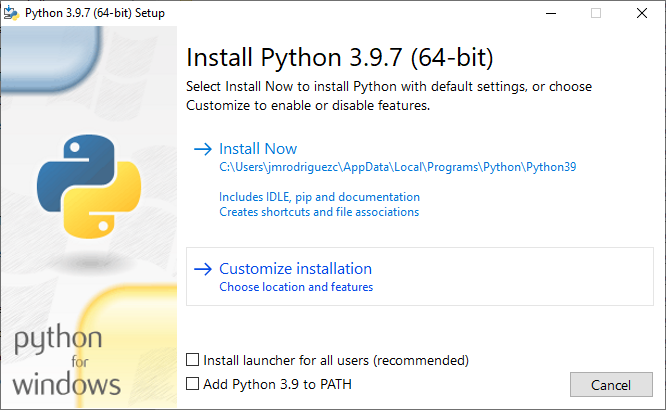
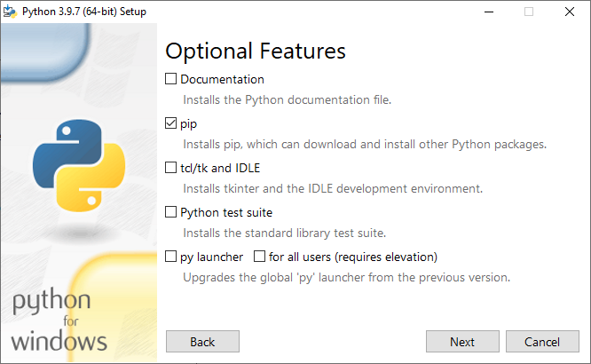
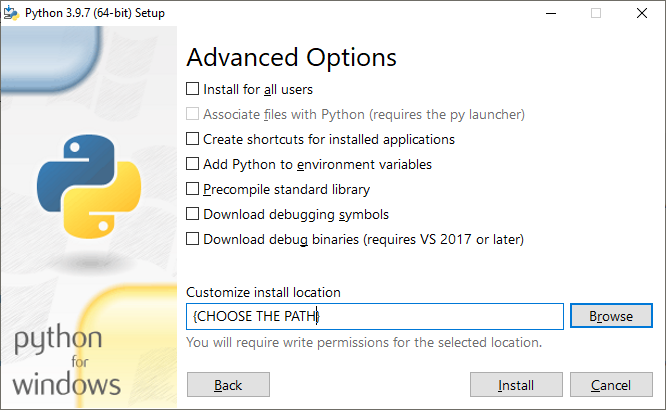

# Steps how to create an environment for iSanXoT

This documentation is for iSanXoT developers.


## Execute iSanXoT in debug mode for Windows distribution

### Clone the repository

1) Clone the iSanXoT repository
```
git clone https://github.com/CNIC-Proteomics/iSanXoT.git
```
2) Access to folder
```
cd iSanXoT
```

### Create the frontend environment, create the python environment, and create the backend environment

1) Create python folder
```
mkdir "S:\U_Proteomica\UNIDAD\DatosCrudos\jmrodriguezc\projects\iSanXoT\resources\exec\python-win-x64"
```

2) Install Python

  2.1) Customize installation:


    
  2.2) Optional features:
  Without documentation, tck, ONLY pip



  2.3) Choose the path:
  Do it in "env/python-3.9.7-win-x64"



3) Execute:
```
cd env
set %PATH%=%PATH%;C:\Users\jmrodriguezc\iSanXoT\env\node&& com.env.win.bat "S:\U_Proteomica\UNIDAD\DatosCrudos\jmrodriguezc\projects\iSanXoT\resources\exec\python-win-x64\python.exe" "C:\Users\jmrodriguezc\iSanXoT\env"
```
Note: You have to write in this way:
...\env\node&& (without space)
Note: The frontend folder (node) has to be in local because otherwise the "OpenDevTools" does not work.

4) Add the Node path into environment variable:
Open CMD
```
setx PATH "%PATH%;C:\Users\jmrodriguezc\iSanXoT\env\node"
```
Close CMD

7) Execute iSanXoT in debug mode:
Open CMD
```
set ISANXOT_MODE=debug&& set ISANXOT_DEV=local&& "C:\Users\jmrodriguezc\iSanXoT\env\node\npm" start
```
Note: You have to write in this way:
=debug&& (without space)


## Build iSanXoT for Windows distribution

### Prepare the Python requeriments for the build

1) Extract the Python packages from the debuging iSanXoT
```
"C:\Users\jmrodriguezc\iSanXoT\env\python\Scripts\pip3.9.exe" freeze > env/packages/win-x64/requirements.txt
cd env/packages/win-x64
"C:\Users\jmrodriguezc\iSanXoT\env\python\Scripts\pip3.9.exe" download -r requirements.txt
ls -1 > requirements_local.txt


```

### Install only python in the resource folder

1) Create python folder
```
mkdir S:\U_Proteomica\UNIDAD\DatosCrudos\jmrodriguezc\projects\iSanXoT\resources\exec\python
```

2) Install Python

  2.1) Customize installation:


    
  2.2) Optional features:
  Without documentation, tck, ONLY pip


  2.3) Choose the path:
  Do it in "env/python-3.9.7-win-x64"


3) Build iSanXoT:
Open New CMD
```
cd "S:\U_Proteomica\UNIDAD\DatosCrudos\jmrodriguezc\projects\iSanXoT"

"C:\Users\jmrodriguezc\iSanXoT\env\node\electron-builder"
```


## for MacOS distribution

### Clone the repository

1) Clone the iSanXoT repository
```
git clone https://github.com/CNIC-Proteomics/iSanXoT.git
```
2) Access to folder
```
cd iSanXoT
```

### Create the frontend environment, create the python environment, and create the backend environment

1) Create python folder
```
mkdir /Users/proteomica/projects/iSanXoT/env/python-3.9.7-darwin-x64
```

2) Install Python in the path

    2.1) Uncompress python
    ```
    cd env
    tar -xvf Python-3.9.7.tgz
    cd Python-3.9.7
    ```
    2.2) Configure python to install in user folder
    ```
    ./configure --prefix=/Users/proteomica/projects/iSanXoT/env/python-3.9.7-darwin-x64
    ```
    2.2) Make
    ```
    make
    ```
    2.3) Make install
    ```
    make install
    ```
3) Execute program that creates the frontend enviroment, and creates the backend environment
```
cd env
export PATH=/Users/proteomica/projects/iSanXoT/env/nodejs/node/bin:$PATH && ./com.env.darwin.sh /Users/proteomica/projects/iSanXoT/env/python-3.9.7-darwin-x64/bin/python3  /Users/proteomica/projects/iSanXoT/env/nodejs
```

### Execute iSanXoT in debug mode

1) Execute iSanXoT in debug mode
```
export ISANXOT_MODE=debug && export PATH=/Users/proteomica/projects/iSanXoT/env/nodejs/node/bin:$PATH && /Users/proteomica/projects/iSanXoT/env/nodejs/node/bin/npm start 
```

### Build iSanXoT

1) Execute the program that builds the packages
```
export PATH=/Users/proteomica/projects/iSanXoT/env/nodejs/node/bin:$PATH && /Users/proteomica/projects/iSanXoT/env/nodejs/node/bin/electron-builder
```


## for Linux distribution

### Clone the repository

1) Clone the iSanXoT repository
```
git clone https://github.com/CNIC-Proteomics/iSanXoT.git
```
2) Access to folder
```
cd iSanXoT
```

### Create the frontend environment, create the python environment, and create the backend environment

1) Create python folder
```
mkdir /home/jmrc/projects/iSanXoT/env/python-3.9.7-linux-x64
```
2) Install Python in the path

    2.1) Uncompress python
    ```
    cd env
    tar -xvf Python-3.9.7.tgz
    cd Python-3.9.7
    ```
    2.2) Configure python to install in user folder
    ```
    ./configure --prefix=/home/jmrc/projects/iSanXoT/env/python-3.9.7-linux-x64
    ```
    2.2) Make
    ```
    make
    ```
    2.3) Make install
    ```
    make install
    ```
3) Execute program that creates the frontend enviroment, and creates the backend environment
```
cd env
export PATH=/home/jmrc/projects/iSanXoT/env/nodejs/node/bin:$PATH && ./com.env.linux.sh /home/jmrc/projects/iSanXoT/env/python-3.9.7-linux-x64/bin/python3 /home/jmrc/projects/iSanXoT/env/nodejs
```

### Execute iSanXoT in debug mode

1) Execute iSanXoT in debug mode
```
export ISANXOT_MODE=debug && export PATH=/home/jmrc/projects/iSanXoT/env/nodejs/node/bin:$PATH && /home/jmrc/projects/iSanXoT/env/nodejs/node/bin/npm start
```

### Build iSanXoT

1) Create python folder
```
mkdir /home/jmrc/projects/iSanXoT/resource/exec/python
```
2) Install Python in the path

    2.1) Uncompress python
    ```
    cd env
    tar -xvf Python-3.9.7.tgz
    cd Python-3.9.7
    ```
    2.2) Configure python to install in user folder
    ```
    ./configure --prefix=/home/jmrc/projects/iSanXoT/resource/exec/python
    ```
    2.2) Make
    ```
    make
    ```
    2.3) Make install
    ```
    make install
    ```
3) Execute the program that builds the packages
```
/home/jmrc/projects/iSanXoT/env/nodejs/node/bin/electron-builder
```